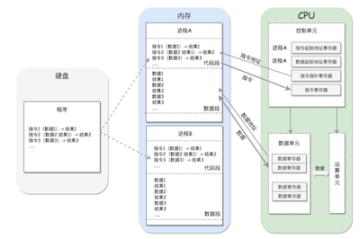
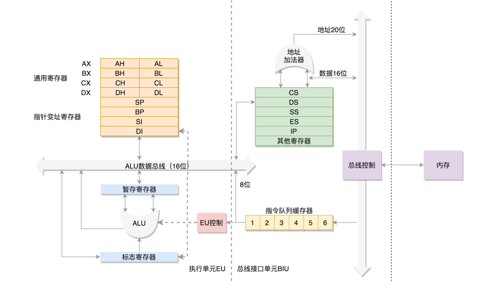
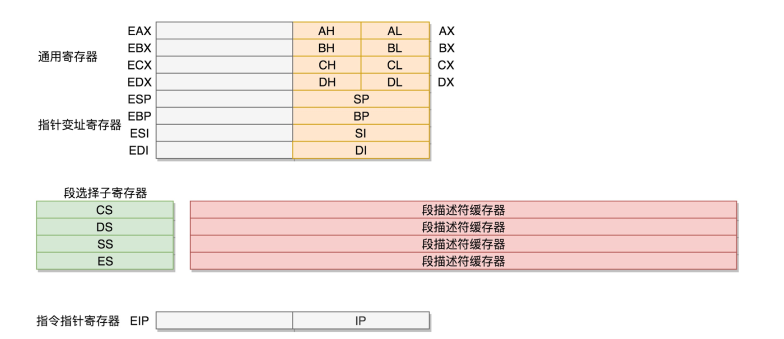
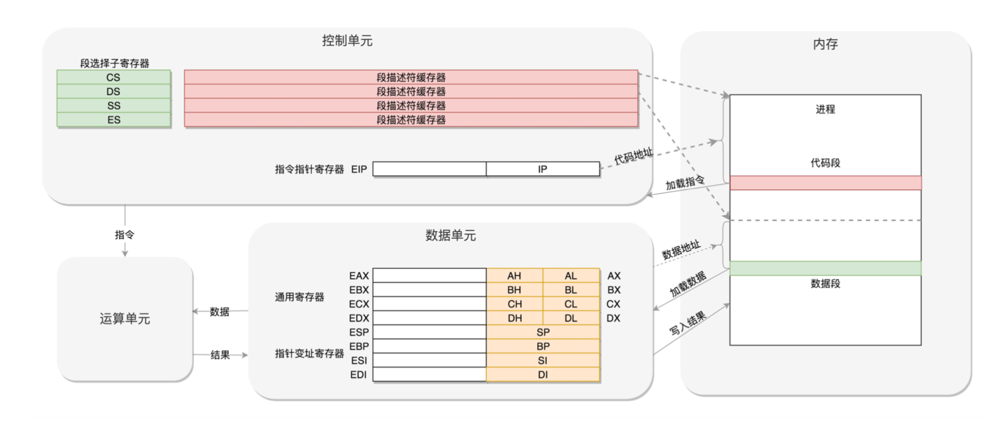

### X86架构

最重要的是内存(Memory)。因为单靠CPU是没办法完成计算任务的，很多复杂的计算任务都需要将中间结 果保存下来，
然后基于中间结果进行进一步的计算。CPU本身没办法保存这么多中间结果，这就要依赖内存了。  

CPU其实也不是单纯的一块，它包括三个部分，运算单元、数据单元和控制单元。
运算单元只管算，例如做加法、做位移等等。但是，它不知道应该算哪些数据，运算结果应该放在哪里。
运算单元计算的数据如果每次都要经过总线，到内存里面现拿，这样就太慢了，所以就有了数据单元。  

数据单元包括CPU内 部的缓存和寄存器组，空间很小，但是速度⻜快，可以暂时存放数据和运算结果。
有了放数据的地方，也有了算的地方，还需要有个指挥到底做什么运算的地方，这就是控制单元。  

控制单元是一个统一的指挥 中心，它可以获得下一条指令，然后执行这条指令。这个指令会指导运算单元取出数据单元中的某几个数据，
计算出个结果， 然后放在数据单元的某个地方。

####   从8086的原理说起

数据单元
8086有8个16为的通用寄存器 ，就是数据单元， 4个通用寄存器， 4个指针变址寄存器  ，在运算过程中暂存数据  

控制单元 

加载到CPU的指令队列中，然后交给运算单元去执行
IP  寄存器就是指令指针寄存器(Instruction Pointer Register)，指向代码段中下一条指令的位置。

如果需要切换进程呢?
cs （code segment register）  代码寄存器
ds  数据段寄存器
ss  栈寄存器  

如果运算中需要加载内存中的数据，需要通过DS找到内存中的数据，
加载到通用寄存器中，应该如何加载呢?对于一个段， 有一个起始的地址，而段内的具体位置，我们称为偏移量(Offset)  

在CS和DS中都存放着一个段的起始地址。  
**代码段的偏移量**在IP寄存器中，  
**数据段的偏移量**会放在通用寄存器中。

这时候问题来了，CS和DS都是16位的，也就是说，起始地址都是16位的，IP寄存器和通用寄存器都是16位的，偏移量也是 16位的，
但是8086的地址总线地址是20位。怎么凑够这20位呢?方法就是“起始地址*16+偏移量”，也就是把CS和DS中的值左 移4位，变成20位的，
加上16位的偏移量，这样就可以得到最终20位的数据地址。  

####  32位处理器
在32位处理器中，有32根地址总线，可以访问2^32=4G的内存   

通用寄存器有扩展，可以将8个16位的扩展到8个32位的，但是依然可以保留16位的和8位的使用方式。  

而改动比较大，有点不兼容的就是段寄存器(Segment Register)。  
CS、SS、DS、ES仍然是16位的，但是不再是段的起始地址    
段的起始地址放在内存的某个 地方。这个地方是一个表格，表格中的一项一项是段描述符(Segment Descriptor)。这里面才是真正的段的起始地址。
而段 寄存器里面保存的是在这个表格中的哪一项，称为选择子(Selector)。  
将一个从段寄存器直接拿到的段起始地址，就变成了先间接地从段寄存器找到表格中的一项，再从表格中的一项中拿到 段起始地址。  

这样段起始地址就会很灵活了。当然为了快速拿到段起始地址，段寄存器会从内存中拿到CPU的描述符高速缓存器中。

因而到了32位的系统架构下，我们将前一种模式称为**实模式(Real Pattern)**，后一种模式称为**保护模式(Protected Pattern)** 

当需要更多内存的时候，你可以遵循一定的规则，进行一系列的操作，然后切换到保护模式，就能够用到32位CPU更强大的 能力。
这也就是说，不能无缝兼容，但是通过切换模式兼容，也是可以接受的。  

