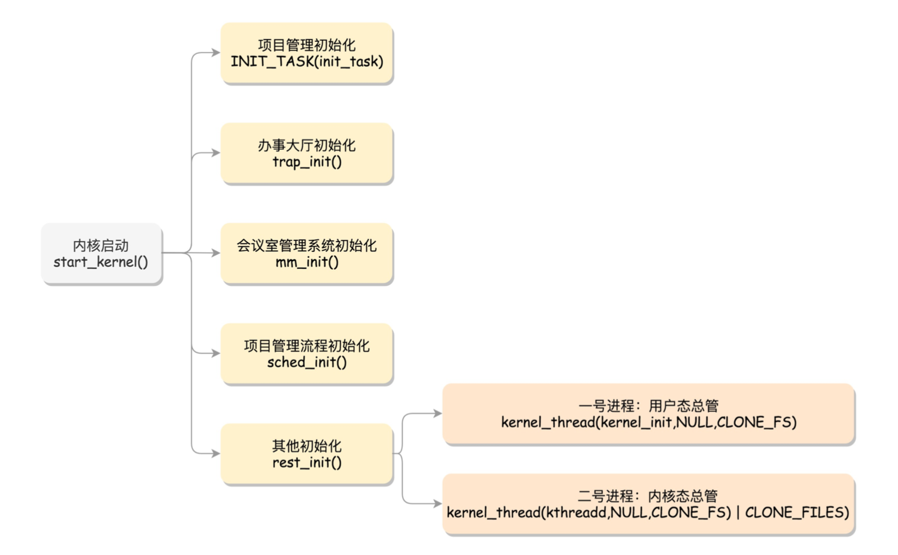
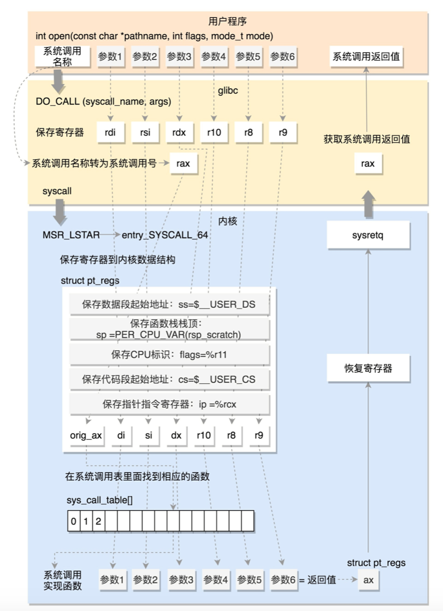

#### BIOS

计算机系统也早有计划。在主板上，有一个东⻄叫ROM(Read Only Memory，只读存储器)。
这和咱们平常说的内 存RAM(Random Access Memory，随机存取存储器)不同。
咱们平时买的内存条是可读可写的，这样才能保存计算结果。
而ROM是只读的，上面早就固化了一些初始化的程序，
也就 是BIOS(Basic Input and Output System，基本输入输出系统）

在x86系统中，将1M空间最上面的0xF0000到0xFFFFF这64K映射给ROM，也就是说，到这部分地址访问的时候，会访问 ROM。
当电脑刚加电的时候，会做一些重置的工作，将CS设置为0xFFFF，将IP设置为0x0000，
所以第一条指令就会指向 0xFFFF0，正是在ROM的范围内。在这里，有一个JMP命令会跳到ROM中做初始化工作的代码，于是，BIOS开始进行初始化 的工作。  

在Linux里面有一个工具，叫Grub2，全称Grand Unified Bootloader Version 2。顾名思义，就 是搞系统启动的。
grub2-mkconfig -o /boot/grub2/grub.cfg  

#### 内核初始化
 
   

v-(5.0.10)
path:init/main.c
line:36
    #include <linux/start_kernel.h>

line:537
    asmlinkage __visible void __init start_kernel(void){}
    
    
在操作系统里面，先要有个创始进程，有一行指令set_task_stack_end_magic(&init_task)。
这里面有一个参数init_task，它的 定义是struct task_struct init_task = INIT_TASK(init_task)。
它是系统创建的第一个进程，我们称为0号进程。这是唯一一个没 有通过fork或者kernel_thread产生的进程，是进程列表的第一个。  

### 系统调用

系统调用表

64位的系统调用定义在另一个文件arch/x86/entry/syscalls/syscall_64.tbl里。例如open是这样定义的:

