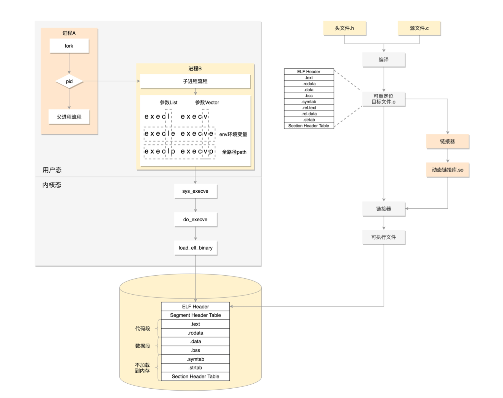

####  进程


#### 用系统调用创建进程

#### 进行编译:程序的二进制格式  

为啥叫可重定位呢?我们可以想象一下，这个编译好的代码和变量，将来加载到内存里面的时候，都 是要加载到一定位置的。
比如说，调用一个函数，其实就是跳到这个函数所在的代码位置执行;再比如修改一个全局变量，
也 是要到变量的位置那里去修改。但是现在这个时候，还是.o文件，不是一个可以直接运行的程序，这里面只是部分代码片段。


要想让create_process这个函数作为库文件被重用，不能以.o的形式存在，而是要形成库文件，
最简单的类型是静态链接库.a 文件(Archives)，仅仅将一系列对象文件(.o)归档为一个文件，使用命令ar创建。  


形成的二进制文件叫可执行文件，是ELF的第二种格式，格式如下  

静态链接库一旦链接进去，代码和变量的section都合并了，因而程序运行的时候，就不依赖于这个库是否存在。但是这样有 一个缺点，就是相同的代码段，
如果被多个程序使用的话，在内存里面就有多份，而且一旦静态链接库更新了，如果二进制执 行文件不重新编译，也不随着更新。  
因而就出现了另一种，动态链接库(Shared Libraries)，不仅仅是一组对象文件的简单归档，而是多个对象文件的重新组 合，可被多个程序共享。

#### 运行程序为进程

在内核中，有这样一个数据结构，用来定义加载二进制文件的方法。  
```   
struct linux_binfmt {
struct list_head lh;
struct module *module;
int (*load_binary)(struct linux_binprm *);
int (*load_shlib)(struct file *);
int (*core_dump)(struct coredump_params *cprm); unsigned long min_coredump; /* minimal dump size */
} __randomize_layout;
```

还记得当时是谁调用的load_elf_binary函数吗?具体是这样的:do_execve->do_execveat_common->exec_binprm->search_binary_handler。  

学过了系统调用一节，你会发现，原理是exec这个系统调用最终调用的load_elf_binary。   

 
#### 进程树

   


##### 线程

如何创建线程，线程都有哪些数据，如何对线程数据进行保护。

######   数据的保护
我们先来看一种方式，Mutex，全称Mutual Exclusion，中文叫互斥。

```  

pthread_mutex_t g_money_lock;

void *transfer(void *notused) {
    pthread_t tid = pthread_self();
    printf("Thread %u is transfering money!\n", (unsigned int)tid);
   
    pthread_mutex_lock(&g_money_lock);
   
    sleep(rand()%10);
    money_of_tom+=10;
    sleep(rand()%10);
    money_of_jerry-=10;

    pthread_mutex_unlock(&g_money_lock);
    
    ...

}

```


