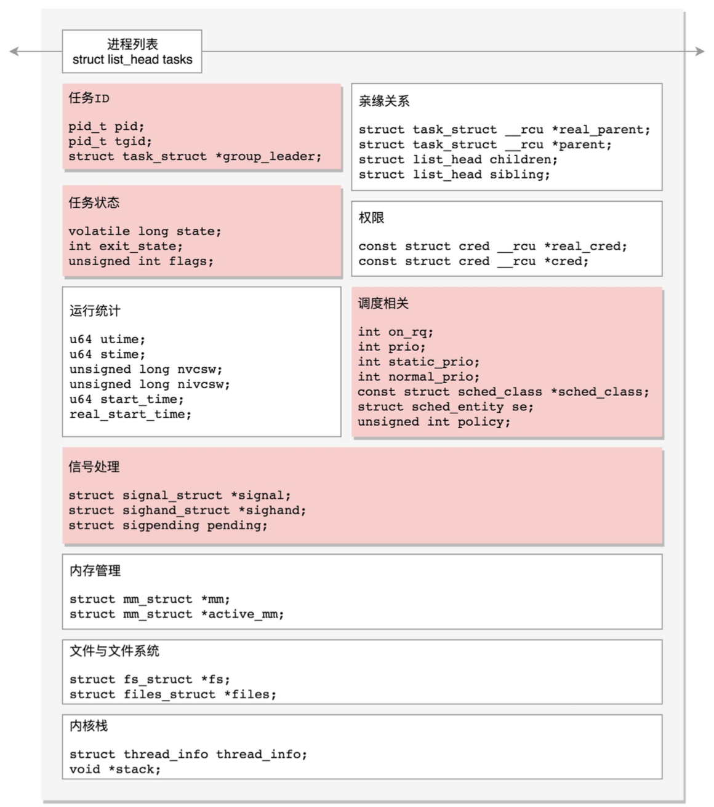

## 进程数据结构

在Linux里面，无论是进程，还是线程，到了内核里面，我们统一都叫任务(Task)，由一个统一的结构task_struct进行 管理    

struct list_head tasks;  

#### 任务ID 

task_struct {
    pid_t pid;
    pid_t tgid;
    struct task_struct *group_leader;
}


在内核中  ：

第一个问题是，任务展示。  

第二个问题是，给任务下发指令。  

其中，pid是process id，tgid是thread group ID。   


####  信号处理  

```` 

/* Signal handlers: */
struct signal_struct *signal; 
struct sighand_struct *sighand; 
sigset_t blocked;
sigset_t real_blocked; 
sigset_t saved_sigmask;
struct sigpending pending; 
unsigned long sas_ss_sp; 
size_t sas_ss_size;
unsigned int sas_ss_flags;

````

这里定义了哪些信号被阻塞暂不处理(blocked)，哪些信号尚等待处理(pending)，哪些信号正在通过信号处理函数进行处 理(sighand)。处理的结果可以是忽略，可以是结束进程等等。

信号处理函数默认使用用户态的函数栈，当然也可以开辟新的栈专⻔用于信号处理，这就是sas_ss_xxx这三个变量的作用。  


#### 任务状态 

```  

volatile long state; /* -1 unrunnable, 0 runnable, >0 stopped */ 
int exit_state;
unsigned int flags;

```


state(状态)可以取的值定义在include/linux/sched.h头文件中。   

从定义的数值很容易看出来，flags是通过bitset的方式设置的也就是说，当前是什么状态，哪一位就置一。   


*TASK_RUNNING*并不是说进程正在运行，而是表示进程在时刻准备运行的状态。当处于这个状态的进程获得时间片的时候， 就是在运行中;如果没有获得时间片，就说明它被其他进程抢占了，在等待再次分配时间片。  

在运行中的进程，一旦要进行一些I/O操作，需要等待I/O完毕，这个时候会释放CPU，进入睡眠状态。  

一种是*TASK_INTERRUPTIBLE*，可中断的睡眠状态。这是一种浅睡眠的状态,也就是说，虽然在睡眠，等待I/O完成，但是 这个时候一个信号来的时候，进程还是要被唤醒。只不过唤醒后，
不是继续刚才的操作，而是进行信号处理。当然程序员可以 根据自己的意愿，来写信号处理函数，例如收到某些信号，就放弃等待这个I/O操作完成，直接退出，也可也收到某些信息， 继续等待。     


另一种睡眠是*TASK_UNINTERRUPTIBLE*，不可中断的睡眠状态。这是一种深度睡眠状态，不可被信号唤醒，只能死等I/O操 作完成。    


_TASK_KILLABLE_，可以终止的新睡眠状态。进程处于这种状态中，它的运行原 理类似TASK_UNINTERRUPTIBLE，只不过可以响应致命信号。  


*TASK_STOPPED*是在进程接收到SIGSTOP、SIGTTIN、SIGTSTP或者SIGTTOU信号之后进入该状态。  

*TASK_TRACED*表示进程被debugger等进程监视，进程执行被调试程序所停止  

一旦一个进程要结束，先进入的是*EXIT_ZOMBIE*状态，但是这个时候它的父进程还没有使用wait()等系统调用来获知它的终止 信息，此时进程就成了**僵尸进程**。 


**EXIT_DEAD**是进程的最终状态。

上面的进程状态和进程的运行、调度有关系，还有其他的一些状态，我们称为**标志**   

PF_EXITING表示正在退出。  
PF_VCPU表示进程运行在虚拟CPU上。  
PF_FORKNOEXEC表示fork完了，还没有exec。  

####  进程调度  


   


####  运行统计信息

在进程的运行过程中，会有一些统计量，具体你可以看下面的列
表。这里面有进程在用户态和内核态消耗的时间、上下文切换的次数等等。  
 
u64 utime;//用戶态消耗的CPU时间  
u64 stime;//内核态消耗的CPU时间  
unsigned long nvcsw;//自愿(voluntary)上下文切换计数 unsigned long nivcsw;//非自愿(involuntary)上下文切换计数 u64 start_time;//进程启动时间，不包含睡眠时间  
u64 real_start_time;//进程启动时间，包含睡眠时间   


####  进程亲缘关系    


 parent指向其父进程。当它终止时，必须向它的父进程发送信号。   
 children表示链表的头部。链表中的所有元素都是它的子进程。     
 sibling用于把当前进程插入到兄弟链表中。   
 
 
####  进程权限  

``` 
/* Objective and real subjective task credentials (COW): */
  const struct cred __rcu         *real_cred;
  /* Effective (overridable) subjective task credentials (COW): */
  const struct cred __rcu         *cred;
 

```

“谁能操作我”，很显然，这个时候我就是被操作的对象，就是Objective，那个想操作我的就是 Subjective。“我能操作谁”，这个时候我就是Subjective，那个要被我操作的就是Objectvie。  
 
real_cred就是说明谁能操作我这个进程，而cred就是说明我这个进程 能够操作谁。   

大部分是关于用户和用户所属的用户组信息。  
  
cap_ambient是比较新加入内核的，就是为了解决cap_inheritable鸡肋的状况，也就是，非root用户进程使 用exec执行一个程序的时候，如何保留权限的问题。当执行exec的时候，cap_ambient会被添加到 cap_permitted中，同时设置到cap_effective中。
  
  
####   内存管理  

虚拟内存空间，这需要有一个数据结构来表示，就是mm_struct  


####  文件与文件系统 


####  用户态函数栈

struct thread_info  thread_info;
  void  *stack;
  
函数调用其实也很简单。如果你去看汇编语言的代码，其实就是指令跳转，从代码的一个地方跳到另外一个
地方。这里比较棘手的问题是，参数和返回地址应该怎么传递过去呢?  


#### 内核态函数栈
Linux给每个task都分配了内核栈。    

内核栈在64位系统上arch/x86/include/asm/page_64_types.h，是这样定义的:在PAGE_SIZE的基础上左移 两位，也即16K，并且要求起始地址必须是8192的整数倍。


####  通过task_struct找内核栈 

这是先从task_struct找到内核栈的开始位置。然后这个位置加上THREAD_SIZE就到了最后的位 置，然后转换为struct pt_regs，再减一，就相当于减少了一个pt_regs的位置，就到了这个结构的首地址。  


#### 通过内核栈找task_struct 


这里面有个成员变量task指向task_struct，所以我们常用current_thread_info()->task来获取task_struct。  

在include/linux/thread_info.h中定义了current_thread_info。 


那current又是什么呢?在arch/x86/include/asm/current.h中定义了。 


多核情况下，CPU是同时运行的，但是它们共同使用其他的硬件资源的时候，我们需要解决多个CPU之间的 同步问题。  

Per CPU变量是内核中一种重要的同步机制。顾名思义，Per CPU变量就是为每个CPU构造一个变量的副 本，这样多个CPU各自操作自己的副本，互不干涉。比如，当前进程的变量current_task就被声明为Per CPU 变量。


####

写一个程序，然后编译为汇编语言，打开看一
下，函数栈是如何起作用的。


