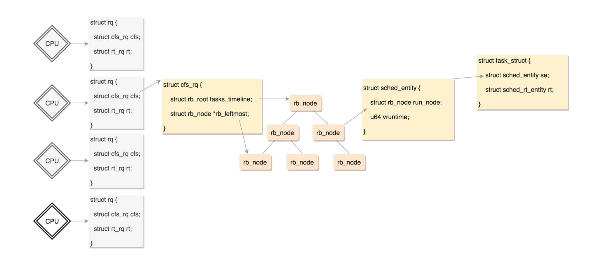
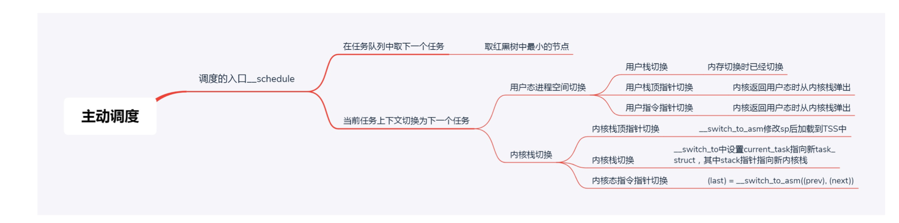
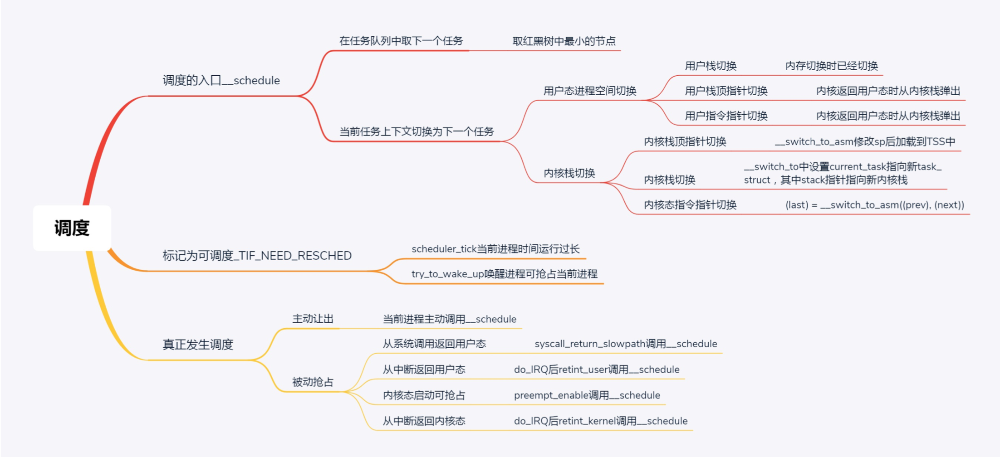

#### 调度策略与调度类

在Linux里面，进程大概可以分成两种。  

一种称为实时进程，也就是需要尽快执行返回结果的那种。  

另一种是普通进程，大部分的进程其实都是这种  


在task_struct中，有一个成员变量，我们叫调度策略。  unsigned int policy;  
```  
    #define SCHED_NORMAL  0
  #define SCHED_FIFO  1
  #define SCHED_RR  2
  #define SCHED_BATCH  3
  #define SCHED_IDLE  5
  #define SCHED_DEADLINE  6

```

配合调度策略的，还有我们刚才说的优先级，也在task_struct中。
对于实时进程，优先级的范围是0~99;对于普通进程，优先级的范围是100~ 139。数值越小，优先级越高。    


####   实时调度策略

例如，SCHED_FIFO就是交了相同钱的，先来先服务，但是有的加钱多，可以分配更高的优先级，也就是 说，高优先级的进程可以抢占低优先级的进程，而相同优先级的进程，我们遵循先来先得。  
另外一种策略是，交了相同钱的，轮换着来，这就是SCHED_RR轮流调度算法，采用时间片，相同优先级的 任务当用完时间片会被放到队列尾部，以保证公平性，而高优先级的任务也是可以抢占低优先级的任务。  
还有一种新的策略是SCHED_DEADLINE，是按照任务的deadline进行调度的。当产生一个调度点的时候， DL调度器总是选择其deadline距离当前时间点最近的那个任务，并调度它执行。    


####  普通调度策略  

SCHED_NORMAL是普通的进程，就相当于咱们公司接的普通项目。  
SCHED_BATCH是后台进程，几乎不需要和前端进行交互。这有点像公司在接项目同时，开发一些可以复用 的模块，作为公司的技术积累，从而使得在之后接新项目的时候，能够减少工作量。这类项目可以默默执 行，不要影响需要交互的进程，可以降低他的优先级。  
SCHED_IDLE是特别空闲的时候才跑的进程，相当于咱们学习训练类的项目，比如咱们公司很长时间没有接 到外在项目了，可以弄几个这样的项目练练手。    


const struct sched_class *sched_class  

stop_sched_class优先级最高的任务会使用这种策略，会中断所有其他线程，且不会被其他任务打断;  
    dl_sched_class就对应上面的deadline调度策略;   
    rt_sched_class就对应RR算法或者FIFO算法的调度策略，具体调度策略由进程的task_struct->policy指定;   
    fair_sched_class就是普通进程的调度策略;   
    idle_sched_class就是空闲进程的调度策略。  
    
    
####  完全公平调度算法     
实现了一个基于CFS的调度算法。CFS全称Completely Fair Scheduling，叫完全公平调度  

>  虚拟运行时间vruntime += 实际运行时间delta_exec * NICE_0_LOAD/权重


####  调度队列与调度实体

看来CFS需要一个数据结构来对vruntime进行排序，找出最小的那个。这个能够排序的数据结构不但需要查 询的时候，能够快速找到最小的，更新的时候也需要能够快速的调整排序，要知道vruntime可是经常在变 的，变了再插入这个数据结构，就需要重新排序。
能够平衡查询和更新速度的是树，在这里使用的是红黑树。  


看来不光CFS调度策略需要有这样一个数据结构进行排序，其他的调度策略也同样有自己的数据结构进行排 序，因为任何一个策略做调度的时候，都是要区分谁先运行谁后运行。  

如果这个进程是个普通进程，则通过sched_entity，将自己挂在这棵红黑树上。  

对于普通进程的调度实体定义如下，这里面包含了vruntime和权重load_weight，以及对于运行时间的统 计。  


  


##  调度类是如何工作的?

  struct sched_class {}


extern const struct sched_class stop_sched_class;
  extern const struct sched_class dl_sched_class;
  extern const struct sched_class rt_sched_class;
  extern const struct sched_class fair_sched_class;
  extern const struct sched_class idle_sched_class;


这个结构定义了很多种方法，用于在队列上操作任务。这里请大家注意第一个成员变量，是一个指针，指向下一个调度类。     

，调度的时候是从优先级最高的调度类到优先级低的调度类，   


sched_class定义的与调度有关的函数。  
enqueue_task向就绪队列中添加一个进程，当某个进程进入可运行状态时，调用这个函数; dequeue_task 将一个进程从就就绪队列中删除;  
pick_next_task 选择接下来要运行的进程;  
put_prev_task 用另一个进程代替当前运行的进程;  
set_curr_task 用于修改调度策略;  
task_tick 每次周期性时钟到的时候，这个函数被调用，可能触发调度。  


####  
一个CPU上有一个队列，CFS的队列是一棵 红黑树，树的每一个节点都是一个sched_entity，每个sched_entity都属于一个task_struct，task_struct里面 有指针指向这个进程属于哪个调度类。   


##  主动调度是如何发生的?


 所谓进程调度，其实就是一个人在做A项目，在某个时刻，换成做B项目去了。发生这种情况，主要有两种 方式。
 方式一:A项目做着做着，发现里面有一条指令sleep，也就是要休息一下，或者在等待某个I/O事件。那没 办法了，就要主动让出CPU，然后可以开始做B项目。
 方式二:A项目做着做着，旷日持久，实在受不了了。项目经理介入了，说这个项目A先停停，B项目也要做 一下，要不然B项目该投诉了。
 
 
####  进程上下文切换 

上下文切换主要干两件事情，一是切换进程空间，也即虚拟内存;二是切换寄存器和CPU上下文。  


####  指令指针的保存与恢复  

进程的调度都最终会调用到__schedule函数。为了方便你记住，我姑且给它起个名字， 就叫“进程调度第一定律”。  


#### 




##   抢占式调度是如何发生的?

一个进程执行时间太长了，是时候切换到另一个进程了。  

算机里面有一个时钟，会过一段时间触发一次时钟中断，通知操作系统，时间又过去一个时钟周 期，这是个很好的方式，可以查看是否是需要抢占的时间点。 

时钟中断处理函数会调用scheduler_tick()  


另外一个可能抢占的场景是当一个进程被唤醒的时候。  

###  抢占的时机
真正的抢占还需要时机，也就是需要那么一个时刻，让正在运行中的进程有机会调用一下__schedule。
你可以想象，不可能某个进程代码运行着，突然要去调用__schedule，代码里面不可能这么写，所以一定要 规划几个时机，这个时机分为用户态和内核态。

####  用户态的抢占时机 

对于用户态的进程来讲，从系统调用中返回的那个时刻，是一个被抢占的时机。 

####  内核态的抢占时机 
对内核态的执行中，被抢占的时机一般发生在在preempt_enable()中。  


在内核态的执行中，有的操作是不能被中断的，所以在进行这些操作之前，总是先调用preempt_disable() 关闭抢占，当再次打开的时候，就是一次内核态代码被抢占的机会。  


在内核态也会遇到中断的情况，当中断返回的时候，返回的仍然是内核态。这个时候也是一个执行抢占的时 机，  


####   


  


