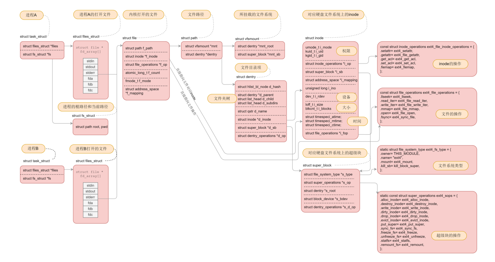

# 虚拟文件系统:文件多了就需要档案管理系统

想往文件系统里面读写数据，需要很多层的组件一起合作

```
应用层  进程  系统调用

内核 每个进程维护自己打开的文件 整个系统维护整个系统的文件系统

linux 支持不同的文件系统  VFS 虚拟文件系统 提供了常见的对象模型
    如 inoode ，directory entry ，mount ， 操作方法 inode directory file operationds 

真正的文件系统 extr4

缓存层

设备IO层 BIO

块设备驱动程序

```

# 挂载文件系统

想要操作文件系统，第一件事情就是挂载文件系统。

内核是不是支持某种类型的文件系统，需要我们进行注册才能知道。
register_filesystem(&ext4_fs_type);


mount系统调用
SYSCALL_DEFINE5{}

理解各个数据结构在这里的关系，非常重要。我这里举一个例子，来解析经过mount之后，刚刚那些数据结构之 间的关系。
我们假设根文件系统下面有一个目录home，有另外一个文件系统A挂载在这个目录home下面。在文件系统A的根目录下面有 另外一个文件夹hello。
由于文件系统A已经挂载到了目录home下面，所以我们就有了目录/home/hello，
然后有另外一个文件 系统B挂在在/home/hello下面。在文件系统B的根目录下面有另外一个文件夹world，在world下面有个文件夹data。
由于文件 系统B已经挂载到了/home/hello下面，所以我们就有了目录/home/hello/world/data。


# 打开文件

在每一个进程的task_struct中，有一个指针files，类型是files_struct。

files_struct里面最重要的是一个文件描述符列表，每打开一个文件，就会在这个列表中分配一项，下标就是文件描述符。

文件描述符列表的每一项都是一个指向struct file的指针，也就是说，每打开一个文件，都会有一个struct file对应。


do_filp_open里面首先初始化了struct nameidata这个结构

在struct nameidata里面有一个关键的成员变量struct path


接下来就调用path_openat，主要做了以下几件事情:
get_empty_filp生成一个struct file结构;
path_init初始化nameidata，准备开始节点路径查找; link_path_walk对于路径名逐层进行节点路径查找，这里面有一个大的循环，用“/”分隔逐层处理; 
do_last获取文件对应的inode对象，并且初始化file对象。


> Linux为了提高目录项对象的处理效率，设计与实现了目录项高速缓存dentry cache，简称dcache。它主要由两个数据结构组
  成:
  哈希表dentry_hashtable:dcache中的所有dentry对象都通过d_hash指针链到相应的dentry哈希链表中; 
  未使用的dentry对象链表s_dentry_lru:dentry对象通过其d_lru指针链入LRU链表中。
  LRU的意思是最近最少使用，我们已 经好几次看到它了。只要有它，就说明⻓时间不使用，就应该释放了。

这两个列表之间会产生复杂的关系:
引用为0:一个在散列表中的dentry变成没有人引用了，就会被加到LRU表中去; 再次被引用:一个在LRU表中的dentry再次被引用了，则从LRU表中移除; 
分配:当dentry在散列表中没有找到，则从Slub分配器中分配一个; 过期归还:当LRU表中最⻓时间没有使用的dentry应该释放回Slub分配器; 
文件删除:文件被删除了，相应的dentry应该释放回Slub分配器; 结构复用:当需要分配一个dentry，但是无法分配新的，就从LRU表中取出一个来复用。
所以，do_last()在查找dentry的时候，当然先从缓存中查找，调用的是lookup_fast。


# 总结

对于虚拟文件系统的解析就到这里了，我们可以看出，有关文件的数据结构层次多，而且很复杂，就得到了下面这张图，
这张 图在这个专栏最开始的时候，已经展示过一遍，到这里，你应该能明白它们之间的关系了。




这张图十分重要，一定要掌握。因为我们后面的字符设备、块设备、管道、进程间通信、网络等等，全部都要用到这里面的知 识。希望当你再次遇到它的时候，能够⻢上说出各个数据结构直接的关系。

这里我带你简单做一个梳理，帮助你理解记忆它。
对于每一个进程，打开的文件都有一个文件描述符，在files_struct里面会有文件描述符数组。每个一个文件描述符是这个数组 的下标，里面的内容指向一个file结构，
表示打开的文件。这个结构里面有这个文件对应的inode，最重要的是这个文件对应的 操作file_operation。如果操作这个文件，就看这个file_operation里面的定义了。
对于每一个打开的文件，都有一个dentry对应，虽然叫作directory entry，但是不仅仅表示文件夹，也表示文件。它最重要的 作用就是指向这个文件对应的inode。
如果说file结构是一个文件打开以后才创建的，dentry是放在一个dentry cache里面的，文件关闭了，他依然存在，因而他可以 更⻓期的维护内存中的文件的表示和硬盘上文件的表示之间的关系。
inode结构就表示硬盘上的inode，包括块设备号等。 几乎每一种结构都有自己对应的operation结构，里面都是一些方法，因而当后面遇到对于某种结构进行处理的时候，如果不
容易找到相应的处理函数，就先找这个operation结构，就清楚了。


