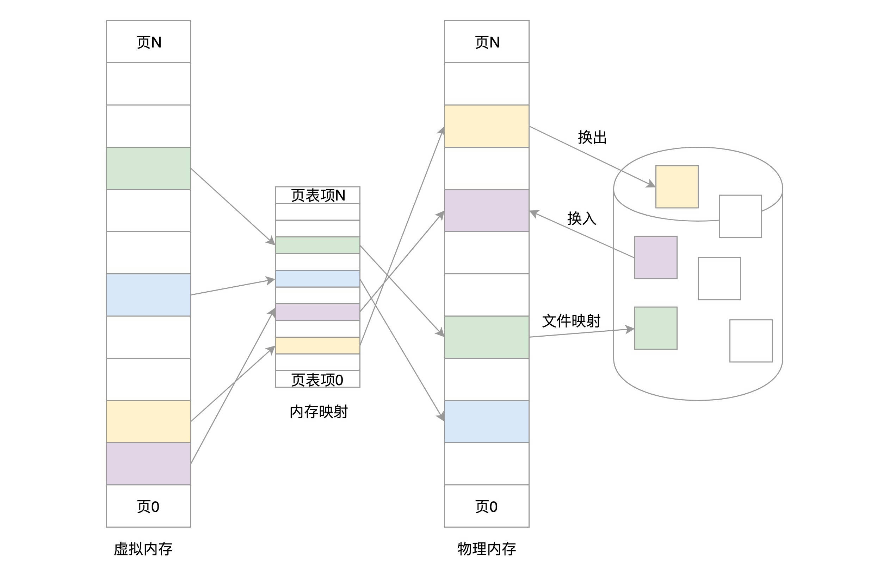

# 为客户保密 规划进程内存空间布局   

计算 一是cpu的使用，另一个是内存管理  

对于每一个进程，内存空间都是独立的  

# 独享内存空间的原理  

实际内存都被分成一块一块的，已经编好号了   

每个进程不能直接访问物理地址，操作系统会给进程分配虚拟内存地址 ，多有进程看到的地址是一样的，
里边都是从0开始编号  

操作系统会经不同进程的虚拟地址和不同内存的物理地址映射起来   

由内核的数据结构进行转换，转换成不同的物理地址， 不同的进程运行的时候写入不同的物理地址，就不会冲突了  

# 规划虚拟地址空间  
1 管理物理内存地址  
2 管理虚拟内存地址  
3 映射他们之间的关系  

对于内存的访问，用户态的进程使用虚拟地址，这点毫无疑问，内核态的也基本都是使用虚拟地址   

目前是站在一个进程的角度去看这个虚拟的空间， 不用管其他进程  

首先，这么大的虚拟空间一切二，一部分用来放内核的东西，称为内核空间，
一部分用来放进程的东西，称为用户空间。用户空间在下，在低地址；内核空间在上，在高地址。
这两部分空间的分界线因为32位和64位的不同而不同，我们这里不深究。

## 总结 

这一节我们讲了为什么要独享内存空间 ，设计了虚拟地址空间应该存放的数据。

通过这一节，你应该知道，一个内存管理系统至少应该做三件事情：

第一，虚拟内存空间的管理，每个进程看到的是独立的、互不干扰的虚拟地址空间；

第二，物理内存的管理，物理内存地址只有内存管理模块能够使用；

第三，内存映射，需要将虚拟内存和物理内存映射、关联起来。

###  有没有一个命令可以查看进程内存空间的布局 ？？？

# 为客户保密   项目组独享会议室封闭开发   

其实Linux倾向于另外一种从虚拟地址到物理地址的转换方式，称为分页（Paging）。

对于物理内存，操作系统把它分成一块一块大小相同的页，这样更方便管理，例如有的内存页面长时间不用了，可以暂时写到硬盘上，称为换出。一旦需要的时候，再加载进来，叫作换入。这样可以扩大可用物理内存的大小，提高物理内存的利用率。

这一节我们讲了分段机制、分页机制以及从虚拟地址到物理地址的映射方式。总结一下这两节，我们可以把内存管理系统精细化为下面三件事情：

第一，虚拟内存空间的管理，将虚拟内存分成大小相等的页；

第二，物理内存的管理，将物理内存分成大小相等的页；

第三，内存映射，将虚拟内存也和物理内存也映射起来，并且在内存紧张的时候可以换出到硬盘中。
