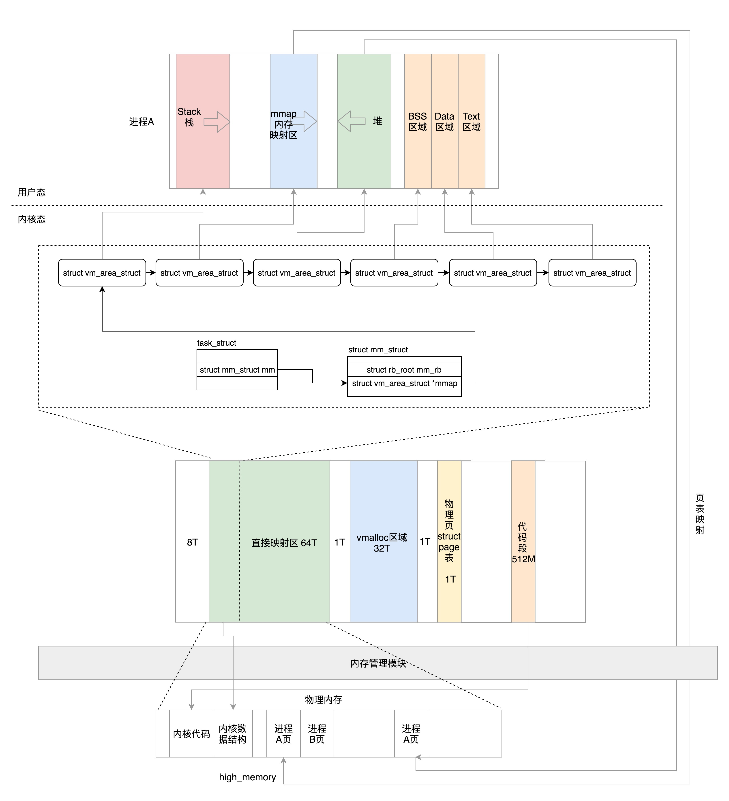

# 进程空间管理 项目组还可以自行不知会议室  

虚拟内存空间的管理、物理内存的管理以及内存映射。你现在对进程内存空间的整体布局应该有了一个大致的了解。
来详细看看第一个方面，进程的虚拟内存空间是如何管理的。

# 用户态和内核态的划分
  进程的虚拟地址空间，其实就是站在项目组的角度来看内存，所以我们就从task_struct出发来看。这里面有一个struct mm_struct结构来管理内存。
  
  
 # 用户态布局  
  
  
  linux 5.0.10 
  
  path fs/binfmt_elf.c  
  line 345
  code struct mm_struct 
  
  
  
  

# 内核态的布局 
  
  内核态的虚拟空间和某一个进程没有关系，所有进程通过系统调用进入到内核之后，看到的虚拟地址空间都是一样的。  
  
  >这里强调一下，千万别以为到了内核里面，咱们就会直接使用物理内存地址了，想当然地认为下面讨论的都是物理内存地址，
  不是的，这里讨论的还是虚拟内存地址，但是由于内核总是涉及管理物理内存，因而总是隐隐约约发生关系，所以这里必须思路清晰，分清楚物理内存地址和虚拟内存地址。
  
  
 在系统启动的时候，物理内存的前1M已经被占用了，从1M开始加载内核代码段，然后就是内核的全局变量、BSS等，也是ELF里面涵盖的。
 这样内核的代码段，全局变量，BSS也就会被映射到3G后的虚拟地址空间里面。具体的物理内存布局可以查看/proc/iomem。     
 
 896M这个值在内核中被定义为high_memory，在此之上常称为“高端内存”。这是个很笼统的说法，到底是虚拟内存的3G+896M以上的是高端内存，还是物理内存896M以上的是高端内存呢？
 
 这里仍然需要辨析一下，**高端内存是物理内存的概念**。它仅仅是内核中的内存管理模块看待物理内存的时候的概念。前面我们也说过，在内核中，除了内存管理模块直接操作物理地址之外，
 内核的其他模块，仍然要操作虚拟地址，而虚拟地址是需要内存管理模块分配和映射好的。
 
 ##  eg
 
 假设咱们的电脑有2G内存，现在如果内核的其他模块想要访问物理内存1.5G的地方，应该怎么办呢？如果你觉得，我有32位的总线，访问个2G还不小菜一碟，这就错了。
 
 首先，你不能使用物理地址。你需要使用内存管理模块给你分配的虚拟地址，但是虚拟地址的0到3G已经被用户态进程占用去了，你作为内核不能使用。
 因为你写1.5G的虚拟内存位置，一方面你不知道应该根据哪个进程的页表进行映射；另一方面，就算映射了也不是你真正想访问的物理内存的地方，
 所以你发现你作为内核，能够使用的虚拟内存地址，只剩下1G减去896M的空间了。
 
 于是，我们可以将剩下的虚拟内存地址分成下面这几个部分。
 
 在896M到VMALLOC_START之间有8M的空间。
 
 VMALLOC_START到VMALLOC_END之间称为**内核动态映射空间**，也即内核想像用户态进程一样malloc申请内存，在内核里面可以使用vmalloc。假设物理内存里面，
 896M到1.5G之间已经被用户态进程占用了，并且映射关系放在了进程的页表中，内核vmalloc的时候，只能从分配物理内存1.5G开始，
 就需要使用这一段的虚拟地址进行映射，映射关系放在专门给内核自己用的页表里面。
 
 PKMAP_BASE到FIXADDR_START的空间称为**持久内核映射**。使用alloc_pages()函数的时候，在物理内存的高端内存得到struct page结构，可以调用kmap将其在映射到这个区域。
 
 FIXADDR_START到FIXADDR_TOP(0xFFFF F000)的空间，称为**固定映射区域，**主要用于满足特殊需求。
 
 在最后一个区域可以通过kmap_atomic**实现临时内核映射**。假设用户态的进程要映射一个文件到内存中，先要映射用户态进程空间的一段虚拟地址到物理内存，
 然后将文件内容写入这个物理内存供用户态进程访问。给用户态进程分配物理内存页可以通过alloc_pages()，分配完毕后，
 按说将用户态进程虚拟地址和物理内存的映射关系放在用户态进程的页表中，就完事大吉了。这个时候，用户态进程可以通过用户态的虚拟地址，
 也即0至3G的部分，经过页表映射后访问物理内存，并不需要内核态的虚拟地址里面也划出一块来，映射到这个物理内存页。但是如果要把文件内容写入物理内存，
 这件事情要内核来干了，这就只好通过kmap_atomic做一个临时映射，写入物理内存完毕后，再kunmap_atomic来解映射即可。  
 
 
 
 ### 64位的内核主要包含以下几个部分。
 
 从0xffff800000000000开始就是内核的部分，只不过一开始有8T的空档区域。
 
 从__PAGE_OFFSET_BASE(0xffff880000000000)开始的64T的虚拟地址空间是**直接映射区域**，也就是减去PAGE_OFFSET就是物理地址。虚拟地址和物理地址之间的映射在大部分情况下还是会通过建立页表的方式进行映射。
 
 从VMALLOC_START（0xffffc90000000000）开始到VMALLOC_END（0xffffe90000000000）的32T的空间是给**vmalloc**的。
 
 从VMEMMAP_START（0xffffea0000000000）开始的1T空间用于存放**物理页面的描述结构struct page**的。
 
 从__START_KERNEL_map（0xffffffff80000000）开始的512M用于存放**内核代码段、全局变量、BSS**等。
 这里对应到物理内存开始的位置，减去__START_KERNEL_map就能得到物理内存的地址。这里和直接映射区有点像，但是不矛盾，因为直接映射区之前有8T的空当区域，早就过了内核代码在物理内存中加载的位置。
 
 
 
 ###  
 
 还记得咱们上一节咱们收集项目组需求的时候，我们知道一个进程要运行起来需要以下的内存结构。
      
      用户态：
      
      代码段、全局变量、BSS
      
      函数栈
      
      堆
      
      内存映射区
      
      内核态：
      
      内核的代码、全局变量、BSS
      
      内核数据结构例如task_struct
      
      内核栈
      
      内核中动态分配的内存
      
      现在这些是不是已经都有了着落？
 
 
 
 

   

 

 
 
 
 
 
 
 
 
 
 
 
 
 
 
 
 
 
 
 
 