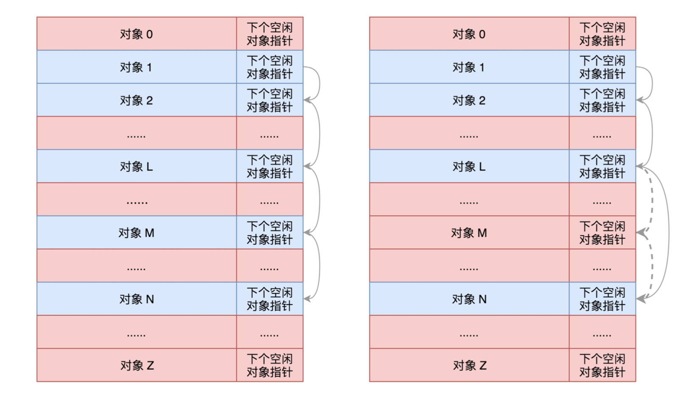
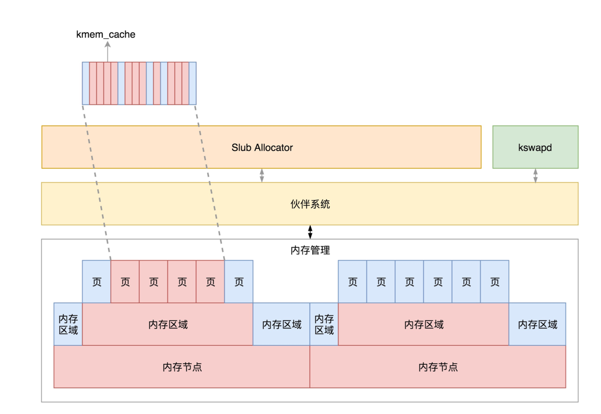

# 物理内存的组织方式 

由于物理地址是连续的，页也是连续的，每个页大小也是一样的。因而对于任何一个地址，只要直接除一下每页的大小，很容易直接算出在哪一页。
每个页有一个结构struct page表示，这个结构也是放在一个数组里面，这样根据页号，很容易通过下标找到相应的struct page结构。
如果是这样，整个物理内存的布局就非常简单、易管理，这就是**最经典的平坦内存模型**（Flat Memory Model）。

在这种模式下，CPU也会有多个，在总线的一侧。所有的内存条组成一大片内存，
在总线的另一侧，所有的CPU访问内存都要过总线，而且距离都是一样的，这种模式称为SMP（Symmetric multiprocessing），
即**对称多处理器**。当然，它也有一个显著的**缺点**，就是**总线会成为瓶颈**  

为了提高性能和可扩展性，后来有了一种更高级的模式，NUMA（Non-uniform memory access），**非一致内存访问**。在这种模式下，
内存不是一整块。每个CPU都有自己的本地内存，CPU访问本地内存不用过总线，因而速度要快很多，每个CPU和内存在一起，称为一个NUMA节点

在本地内存不足的情况下，每个CPU都可以去另外的NUMA节点申请内存，这个时候访问延时就会比较长。 

# 节点  

我们首先要能够表示NUMA节点的概念，于是有了下面这个结构typedef struct pglist_data pg_data_t  

每一个节点都有自己的ID：node_id；

node_mem_map就是这个节点的struct page数组，用于描述这个节点里面的所有的页；

node_start_pfn是这个节点的起始页号；

node_spanned_pages是这个节点中包含不连续的物理内存地址的页面数；

node_present_pages是真正可用的物理页面的数目。

每一个节点分成一个个区域zone，放在数组node_zones里面。这个数组的大小为MAX_NR_ZONES。我们来看区域的定义。

ZONE_DMA是指可用于作DMA（Direct Memory Access，**直接内存存取**）的内存。DMA是这样一种机制：
        
        要把外设的数据读入内存或把内存的数据传送到外设，原来都要通过CPU控制完成，但是这会占用CPU，
        影响CPU处理其他事情，所以有了DMA模式。CPU只需向DMA控制器下达指令，让DMA控制器来处理数据的传送，
        数据传送完毕再把信息反馈给CPU，这样就可以解放CPU。

对于64位系统，有两个DMA区域。除了上面说的ZONE_DMA，还有ZONE_DMA32。在这里你大概理解DMA的原理就可以，不必纠结，我们后面会讲DMA的机制。

*ZONE_NORMAL*是直**接映射区**，就是上一节讲的，从物理内存到虚拟内存的内核区域，通过加上一个常量直接映射。

ZONE_HIGHMEM是**高端内存区**，就是上一节讲的，对于32位系统来说超过896M的地方，对于64位没必要有的一段区域。

ZONE_MOVABLE是**可移动区域**，通过将物理内存划分为可移动分配区域和不可移动分配区域来避免内存碎片。

**这里你需要注意一下，我们刚才对于区域的划分，都是针对物理内存的。**

nr_zones表示当前节点的区域的数量。node_zonelists是备用节点和它的内存区域的情况。
前面讲NUMA的时候，我们讲了CPU访问内存，本节点速度最快，但是如果本节点内存不够怎么办，还是需要去其他节点进行分配。毕竟，就算在备用节点里面选择，慢了点也比没有强。

# 区域

到这里，我们把内存分成了节点，把节点分成了区域。接下来我们来看，一个区域里面是如何组织的。

在一个zone里面，zone_start_pfn表示属于这个zone的第一个页。

present_pages = spanned_pages - absent_pages(pages in holes)，也即present_pages是这个zone在物理内存中真实存在的所有page数目。

#  页

了解了区域zone，接下来我们就到了组成物理内存的基本单位，页的数据结构struct page。   

这里之所以用了union，是因为一个物理页面使用模式有多种。  

第一种模式，要用就用一整页。 

这一整页的内存，或者直接和虚拟地址空间建立映射关系，我们把这种称为匿名页（Anonymous Page）。或者用于关联一个文件，然后再和虚拟地址空间建立映射关系，这样的文件，我们称为内存映射文件（Memory-mapped File）。

第二种模式，仅需分配小块内存。 

为了满足对这种小内存块的需要，Linux系统采用了一种被称为slab allocator的技术，用于分配称为slab的一小块内存 

也正是因为slab allocator对于队列的维护过于复杂，后来就有了一种不使用队列的分配器slub allocator，后面我们会解析这个分配器。
但是你会发现，它里面还是用了很多slab的字眼，因为它保留了slab的用户接口，可以看成slab allocator的另一种实现。

# 页的分配

对于要分配比较大的内存，例如到分配页级别的，可以使用伙伴系统（Buddy System）。

Linux中的内存管理的“页”大小为4KB。把所有的空闲页分组为11个页块链表，每个块链表分别包含很多个大小的页块，
有1、2、4、8、16、32、64、128、256、512和1024个连续页的页块。最大可以申请1024个连续页，对应4MB大小的连续内存。每个页块的第一个页的物理地址是该页块大小的整数倍。

第i个页块链表中，页块中页的数目为2^i。 

当向内核请求分配(2^(i-1)，2^i]数目的页块时，按照2^i页块请求处理。如果对应的页块链表中没有空闲页块，那我们就在更大的页块链表中去找。
当分配的页块中有多余的页时，伙伴系统会根据多余的页块大小插入到对应的空闲页块链表中。

例如，要请求一个128个页的页块时，先检查128个页的页块链表是否有空闲块。如果没有，则查256个页的页块链表；如果有空闲块的话，则将256个页的页块分成两份，
一份使用，一份插入128个页的页块链表中。如果还是没有，就查512个页的页块链表；如果有的话，就分裂为128、128、256三个页块，一个128的使用，剩余两个插入对应页块链表。

上面这个过程，我们可以在分配页的函数alloc_pages中看到。 

GFP_USER用于分配一个页映射到用户进程的虚拟地址空间，并且希望直接被内核或者硬件访问，主要用于一个用户进程希望通过内存映射的方式，访问某些硬件的缓存，例如显卡缓存；

GFP_KERNEL用于内核中分配页，主要分配ZONE_NORMAL区域，也即直接映射区；

GFP_HIGHMEM，顾名思义就是主要分配高端区域的内存。

另一个参数order，就是表示分配2的order次方个页。 

它会调用get_page_from_freelist。这里面的逻辑也很容易理解，就是在一个循环中先看当前节点的zone。如果找不到空闲页，则再看备用节点的zone。 

每一个zone，都有伙伴系统维护的各种大小的队列，就像上面伙伴系统原理里讲的那样。这里调用rmqueue就很好理解了，就是找到合适大小的那个队列，把页面取下来。 

接下来的调用链是rmqueue->__rmqueue->__rmqueue_smallest。在这里，我们能清楚看到伙伴系统的逻辑。

### 

对于物理内存的管理的讲解，到这里要告一段落了。这一节我们主要讲了物理内存的组织形式，就像下面图中展示的一样。

如果有多个CPU，那就有多个节点。每个节点用struct pglist_data表示，放在一个数组里面。

每个节点分为多个区域，每个区域用struct zone表示，也放在一个数组里面。

每个区域分为多个页。为了方便分配，空闲页放在struct free_area里面，使用伙伴系统进行管理和分配，每一页用struct page表示。

#  小内存的分配

前面我们讲过，如果遇到小的对象，会使用slub分配器进行分配。那我们就先来解析它的工作原理。 

从这段代码可以看出，它调用了kmem_cache_alloc_node函数，在task_struct的缓存区域**task_struct_cachep**分配了一块内存   

缓存区中每一块的大小正好等于task_struct的大小，也即 arch_task_struct_size。
 

有了这个缓存区，每次创建task_struct的时候，我们不用到内存里面去分配，先在缓存里面看看有没有直接可用的，这就 是kmem_cache_alloc_node的作用。 

当一个进程结束，task_struct也不用直接被销毁，而是放回到缓存中，这就是kmem_cache_free的作用。这样，新进程创建 的时候，我们就可以直接用现成的缓存中的task_struct了。

所有 的缓存最后都会放在一个链表里面，也就是LIST_HEAD(slab_caches)。 

**对于缓存来讲，其实就是分配了连续几⻚的大内存块，然后根据缓存对象的大小，切成小内存块。** 

最终，我们将大内存块切分成小内存块，样子就像下面这样。

 

每一项的结构都是缓存对象后面跟一个下一个空闲对象的指针，这样非常方便将所有的空闲对象链成一个链。其实，这就相当 于咱们数据结构里面学的，用数组实现一个可随机插入和删除的链表。  
所以，这里面就有三个变量:size是包含这个指针的大小，object_size是纯对象的大小，offset就是把下一个空闲对象的指针 存放在这一项里的偏移量。  
那这些缓存对象哪些被分配了、哪些在空着，什么情况下整个大内存块都被分配完了，需要向伙伴系统申请几个⻚形成新的大 内存块?这些信息该由谁来维护呢?  

接下来就是最重要的两个成员变量出场的时候了。kmem_cache_cpu和kmem_cache_node，它们都是每个NUMA节点上有一 个，我们只需要看一个节点里面的情况。

在分配缓存块的时候，要分两种路径，fast path和slow path，也就是快速通道和普通通道。其中kmem_cache_cpu就是快速 通道，kmem_cache_node是普通通道。
每次分配的时候，要先从kmem_cache_cpu进行分配。如果kmem_cache_cpu里面没 有空闲的块，那就到kmem_cache_node中进行分配;如果还是没有空闲的块，才去伙伴系统分配新的⻚。

快速通道很简单，取出cpu_slab也即kmem_cache_cpu的freelist，这就是第一个空闲的项，可以直接返回了。如果没有空闲的 了，则只好进入普通通道，调用__slab_alloc。

在这里，我们首先再次尝试一下kmem_cache_cpu的freelist。为什么呢?万一当前进程被中断，等回来的时候，别人已经释放 了一些缓存，
说不定又有空间了呢。如果找到了，就跳到load_freelist，在这里将freelist指向下一个空闲项，返回就可以了。
如果freelist还是没有，则跳到new_slab里面去。这里面我们先去kmem_cache_cpu的partial里面看。如果partial不是空的，
那 就将kmem_cache_cpu的page，也就是快速通道的那一大块内存，替换为partial里面的大块内存。然后redo，重新试下。这 次应该就可以成功了。

如果真的还不行，那就要到new_slab_objects了。 

在这里面，get_partial会根据node id，找到相应的kmem_cache_node，然后调用get_partial_node，开始在这个节点进行分 配 

在这里，我们看到了alloc_slab_page分配⻚面。分配的时候，要按kmem_cache_order_objects里面的order来。如果第一次 分配不成功，说明内存已经很紧张了，那就换成min版本的kmem_cache_order_objects。

好了，这个复杂的层层分配机制，我们就讲到这里，你理解到这里也就够用了。 

# ⻚面换出 

通过这个调用链可以看出，⻚面换出也是以内存节点为单位的。 

当然还有一种情况，就是作为内存管理系统应该主动去做的，而不能等真的出了事儿再做，这就是内核线程kswapd。这个内 核线程，在系统初始化的时候就被创建。
这样它会进入一个无限循环，直到系统停止。在这个循环中，如果内存使用没有那么 紧张，那它就可以放心睡大觉;如果内存紧张了，就需要去检查一下内存，看看是否需要换出一些内存⻚。

这里的调用链是balance_pgdat->kswapd_shrink_node->shrink_node，是以内存节点为单位的，最后也是调用shrink_node。
shrink_node会调用shrink_node_memcg。这里面有一个循环处理⻚面的列表，看这个函数的注释，其实和上面我们想表达的 内存换出是一样的。

内存⻚总共分两类，一类是匿名⻚，和虚拟地址空间进行关联;一类是内存映射，不但和虚拟地址空间关联，还和文件管理关 联。

它们每一类都有两个列表，一个是active，一个是inactive。顾名思义，active就是比较活跃的，inactive就是不怎么活跃的。
这 两个里面的⻚会变化，过一段时间，活跃的可能变为不活跃，不活跃的可能变为活跃。如果要换出内存，那就是从不活跃的列 表中找出最不活跃的，换出到硬盘上。

####  

####

好了，对于物理内存的管理就讲到这里了，我们来总结一下。对于物理内存来讲，从下层到上层的关系及分配模式如下: 物理内存分NUMA节点，分别进行管理;
每个NUMA节点分成多个内存区域;
每个内存区域分成多个物理⻚面;
伙伴系统将多个连续的⻚面作为一个大的内存块分配给上层; kswapd负责物理⻚面的换入换出;
Slub Allocator将从伙伴系统申请的大内存块切成小块，分配给其他系统。

